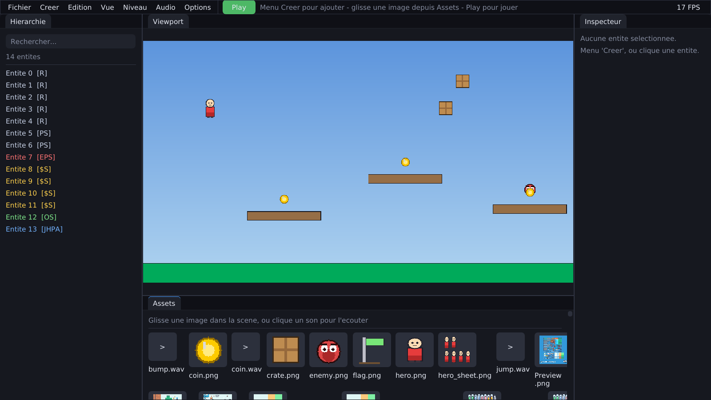
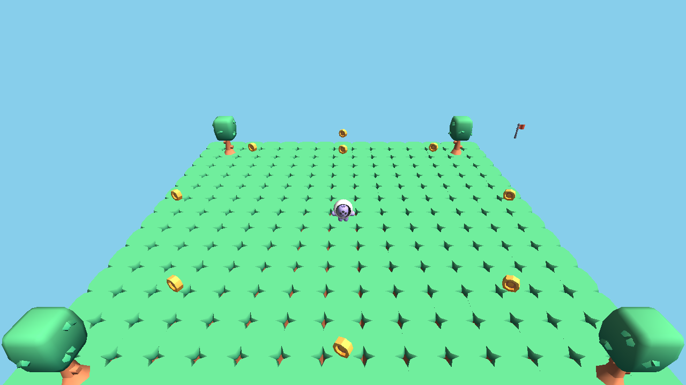

# MoteurJV

Un moteur de jeu open source, léger et moderne — en C++ (**2D et 3D**).

> État : **v1.2** 🎉 — Moteur **2D + 3D** avec un **éditeur visuel no-code** : on
> construit ET on joue un jeu **entièrement à la souris, sans écrire de code**.
> Côté 2D : **ECS**, rendu, input (clavier + souris), **collisions AABB**, **sprites
> animés**, **audio**, **physique** (gravité, saut, corps poussables), **scripting
> Lua** (ECS exposé) et un **éditeur façon Unity** (hiérarchie colorée, inspecteur
> live, viewport, glisser-déposer d'assets, peinture de tuiles, **IA** ennemie,
> particules, menus in-game, options touches/langue/son, multi-niveaux, JSON).
> Côté **3D** : caméra perspective, **chargement de modèles** (.glb/.gltf/.obj),
> **éclairage directionnel** — démo collectathon avec modèles Kenney CC0.



*L'éditeur façon Unity : hiérarchie colorée par type, viewport, inspecteur, panneau
d'assets — on construit ET on joue un jeu **sans écrire de code**.*



*La 3D : modèles **Kenney CC0**, éclairage directionnel, petit collectathon jouable.*

## Philosophie

Commencer **petit et focalisé**. On ne réécrit pas Unity en un week-end. La stack
graphique bas niveau (raylib) est **cachée derrière une API propre `mjv::`** : ton
code de jeu ne touche jamais directement à OpenGL/raylib, exactement comme tu
utiliserais Unity sans écrire de DirectX. Le jour où on remplace le backend (Vulkan,
SDL…), le code de jeu ne bouge pas.

## Est-ce vraiment « un moteur » ?

Oui — au sens où **tu déclares ce que tes objets *sont*, et le moteur sait quoi en
faire**. Tu n'écris pas le « comment » à chaque fois.

```cpp
Entity hero = reg.create();
reg.add<Transform2D>(hero, ...);   // il a une position
reg.add<Velocity>(hero, ...);      // il peut se déplacer
reg.add<Sprite>(hero, ...);        // il s'affiche avec cette image
reg.add<Animator>(hero, ...);      // il a des animations
reg.add<AABB>(hero, ...);          // il a une boîte de collision
reg.add<PlayerControl>(hero, ...); // il est piloté au clavier
```

À partir de là, les **systèmes** génériques réagissent tout seuls : `Velocity` +
`Transform` → il bouge ; `Animator` → ses frames défilent ; `AABB` → il ne
traverse plus les murs. **Rien à recoder.** Preuve : les caisses de la démo ne sont
que `Transform + RectShape + AABB` — elles deviennent des obstacles solides sans
une ligne de logique en plus.

**Séparation moteur / jeu :**

| Le **moteur** (`engine/`, réutilisable) | Le **jeu** (`examples/`, spécifique) |
|---|---|
| *Comment* afficher, déplacer, animer, collisionner | *Quoi* : ce perso, ces caisses, à ces positions |
| Marche pour n'importe quel jeu | Change à chaque projet |

**Ce qu'on a aujourd'hui :**

- ✅ Le **cœur** d'un moteur (la machinerie ECS) — la partie techniquement la plus dure
- ✅ Rendu, input (clavier + souris), collisions AABB, sprites animés, audio, mini-physique
- ✅ **Scripting Lua** : créer un jeu (entités, composants, physique) **sans recompiler**
- ✅ **Éditeur visuel façon Unity** : hiérarchie, inspecteur live, viewport,
  glisser-déposer d'assets, sauvegarde/chargement JSON

C'est désormais un **vrai moteur utilisable** : il a franchi le stade « moteur-code »
et possède un éditeur — comme l'ont fait Unity et Godot après leurs débuts. Il
reste évidemment beaucoup à étoffer : voir la **longue liste de fonctionnalités
futures** plus bas.

## Architecture actuelle

```
MoteurJV/
├── engine/                  # La bibliothèque du moteur (cible CMake "mjv")
│   ├── include/mjv/         # API publique
│   │   ├── Application.hpp  #   boucle de jeu, fenêtre, delta time
│   │   ├── Graphics.hpp     #   façade de rendu 2D
│   │   ├── Input.hpp        #   clavier + souris
│   │   ├── Texture.hpp      #   chargement d'images + dessin de régions (spritesheet)
│   │   ├── Components.hpp   #   composants génériques (Velocity, RectShape, Sprite, AABB)
│   │   ├── Animation.hpp    #   AnimationClip + Animator (spritesheet)
│   │   ├── Audio.hpp        #   mjv::Audio, Sound, Music
│   │   ├── Collision.hpp    #   AABB : overlap + résolution (MTV)
│   │   ├── Physics.hpp      #   mini-physique : gravité + saut + AABB (physicsStep)
│   │   ├── Render3D.hpp     #   3D : caméra, primitives, modèles (.glb/.obj) + éclairage
│   │   ├── ecs/Registry.hpp #   ECS : Entity, Component, view<...> (systèmes)
│   │   ├── Math.hpp         #   Vec2, Transform2D, Rect
│   │   └── Color.hpp
│   └── src/                 # implémentations (raylib vit ici, et nulle part ailleurs)
├── examples/
│   ├── 01_perso2d/          # démo technique : perso animé, collisions, physique
│   │   └── assets/          #   hero_sheet.png (généré), sons (généré)
│   ├── 02_jeu/              # un VRAI petit jeu : platformer 3 niveaux + ennemis
│   ├── 03_lua/              # un jeu écrit en Lua (game.lua) — sans recompiler
│   ├── 04_lua_ecs/          # l'ECS + la physique pilotés depuis Lua (scene.lua)
│   ├── 05_editor/           # ÉDITEUR visuel facon Unity (Dear ImGui docking)
│   └── 06_3d/               # première démo 3D (cube jouable, caméra orbitale)
├── tools/                   # make_sprite.py (génère les assets), scripts WSL
├── build.sh                 # build + run sous Linux/WSL
├── build.ps1                # build + run sous Windows natif
└── CMakeLists.txt
```

## Compiler et lancer

raylib est téléchargé et compilé automatiquement par CMake dans les deux cas.

### Linux / WSL2  (méthode utilisée ici ✅)

Sur cette machine, **Smart App Control** (Windows 11) bloque l'exécution de tout
`.exe` compilé localement et non signé. On développe donc sous **WSL2 (Ubuntu)** :
les binaires Linux ne sont pas concernés, et la fenêtre s'affiche via WSLg.

```bash
# dans Ubuntu (WSL) :
./build.sh run        # la démo technique (examples/01_perso2d)
./build.sh run jeu    # le petit jeu : platformer 3 niveaux (examples/02_jeu)
./build.sh run lua    # un jeu écrit en Lua (examples/03_lua)
./build.sh run lua-ecs # l'ECS + la physique pilotés en Lua (examples/04_lua_ecs)
./build.sh run editor  # l'éditeur visuel ImGui (examples/05_editor)
./build.sh run 3d      # la première démo 3D (examples/06_3d)
```

Dépendance supplémentaire pour l'exemple Lua : `liblua5.4-dev`
(`sudo apt install liblua5.4-dev`). sol2 est récupéré par CMake.

Dépendances Ubuntu (déjà installées) : `cmake`, `build-essential`,
`libgl1-mesa-dev`, `libx11-dev`, `libxrandr-dev`, `libxinerama-dev`,
`libxcursor-dev`, `libxi-dev`, `libwayland-dev`, `libxkbcommon-dev`.

**Audio sous WSL** : il faut `libpulse0` (chargé à l'exécution par raylib) et
pointer le serveur PulseAudio de WSLg. `build.sh run` le fait automatiquement
(`PULSE_SERVER=unix:/mnt/wslg/PulseServer`). Sans ça, le moteur tourne mais le
backend audio reste `Null` (aucun son). En natif Windows, rien à configurer.

### Windows natif  (si Smart App Control est désactivé)

Prérequis : **Visual Studio Build Tools 2022** (workload C++, ARM64) + CMake.

```powershell
.\build.ps1 -Run
```

**Commandes :** **Gauche/Droite** (Flèches / ZQSD / WASD) · **Espace** (ou
Haut/Z/W) pour **sauter** · **Tab** affiche les boîtes de collision · **P**
coupe/relance la musique.

## Le jeu d'exemple (`examples/02_jeu`)

Un vrai petit **platformer** construit entièrement avec le moteur — la meilleure
preuve que MoteurJV sert à faire des jeux :

- **3 niveaux** enchaînés, avec sol et plateformes
- **Ennemis** qui patrouillent : saute sur la tête pour les éliminer (+200),
  touche-les sur le côté et tu perds une vie
- **Pièces** à ramasser (+100), **score** et **vies** (3)
- Écrans **victoire** / **game over** (Entrée pour rejouer)

Commandes : **Gauche/Droite** (Flèches ou ZQSD) · **Espace** pour sauter ·
**Tab** debug collisions · **P** musique.

## Éditeur visuel (`examples/05_editor`)

Un éditeur **Dear ImGui** (branche docking + backend [rlImGui](https://github.com/raylib-extras/rlImGui),
le tout récupéré par CMake) avec un look **facon Unity**, et surtout **no-code** :
tu construis et tu joues un jeu sans écrire une ligne.

**Le flux sans code :**
1. Menu **Créer** → *Joueur*, *Plateforme*, *Caisse*, *Ennemi*, *Pièce*, *Objectif* (entités prêtes)
2. Place-les à la souris, règle tout dans l'**Inspecteur** (taille, couleur, vitesse, saut, portée, points…)
3. Glisse une **image** depuis Assets pour l'ajouter à la scène
4. Appuie sur **Play** : ça devient un **vrai jeu jouable de bout en bout** —
   gravité, **joueur au clavier**, **ennemis qui patrouillent**, **pièces à ramasser**
   (score), **objectif** de fin (Victoire), contact ennemi (Perdu), **caméra qui
   suit le joueur**. **Stop** restaure la scène d'édition.
5. **Sauvegarde** la scène en JSON

Une boucle de jeu complète **sans une ligne de code**, avec du **jus** : de **vrais
sprites** (joueur, ennemi, pièce, drapeau, caisse — générés sans dépendance), sons
de gameplay (plop, jingle de victoire, game over), **vies** + respawn, **temps
limite** optionnel, **score**, et un **écran de fin stylé**. Les comportements sont
des composants à cocher : `Controllable` (joueur), `Patrol` (ennemi), `Collectible`
(pièce), `Goal` (objectif), `Health` (vies).

**Plusieurs niveaux enchaînés** : chaque scène est un fichier `niveauN.json`. En
atteignant l'objectif, le **niveau suivant se charge** (Entrée), le score se cumule.
Le menu **Niveau** permet de sauvegarder/charger n'importe quel numéro et de régler
le temps limite. Deux niveaux de démo sont créés au premier lancement.

**Édition riche du niveau :**
- **Navigation** : molette = zoom, clic droit = déplacer la vue (parcourir tout le niveau)
- **Grille magnétique** (menu Vue) : placement et redimensionnement alignés sur la grille
- **Poignées de redimensionnement** : 4 coins bleus sur l'entité sélectionnée, à tirer à la souris
- **Tuiles** (Créer → Tuile) : blocs de sol à stamper pour bâtir des plateformes
- **Changer le skin** : dans l'Inspecteur, clique une autre image pour remplacer le sprite d'une entité
- **Packs d'assets** : dépose tes PNG (ex. [Kenney](https://kenney.nl/assets), même en sous-dossier)
  dans le dossier d'assets → ils apparaissent automatiquement dans le panneau Assets et les skins
- **Joueur animé** : le sprite du joueur joue son cycle **marche / idle** et se
  retourne selon la direction en mode Play (composant `AnimSprite`, réglable dans l'Inspecteur)

Détails techniques : thème sombre custom, **layout ancré (DockSpace)** 3 zones, le
jeu rendu dans une **RenderTexture** affichée dans le Viewport, caméra 2D (pan/zoom
en édition, suivi du joueur en jeu).

- **Hiérarchie** (gauche) : liste toutes les entités du `Registry`, cliquables
- **Inspecteur** (droite) : édite **en temps réel** les composants de l'entité
  sélectionnée (position, taille, **couleur**, vitesse, gravité…), ajoute/retire
  des composants
- **Viewport cliquable** : clique une entité dans la scène pour la sélectionner ;
  **glisse-la à la souris** pour la repositionner
- **Glisser-déposer d'assets** : depuis le panneau Assets, **glisse une image dans
  le viewport** (ou clique-la) pour créer une entité qui l'affiche
- **Play / Pause** : lance la physique du moteur pendant que tu édites ; en Play,
  l'**entité sélectionnée est jouable au clavier** — pilotage physique (avec saut)
  si elle a un `RigidBody`, sinon déplacement libre
- **Sauver / Charger** : sérialise toute la scène en **JSON** (`scene.json`),
  images comprises — la brique qui transforme l'éditeur en outil de production
- **Panneau Assets** (bas) : **miniatures** des images, **lecture des sons au clic**
- Fenêtre large redimensionnable + **compteur de FPS**
- L'entité sélectionnée est surlignée en jaune ; panneaux **dockables** (comme Unity)

**Phase 3 complète** (hiérarchie + inspecteur + viewport souris + glisser-déposer
d'assets + sérialisation + look Unity dockable).

## 3D (`examples/06_3d`)

Le moteur fait aussi de la **3D**. L'API `mjv::Graphics3D` (raylib caché) fournit une
caméra perspective, des primitives et le **chargement de modèles** (`mjv::Model`,
formats `.glb`/`.gltf`/`.obj` avec textures), plus un **éclairage directionnel**.

La démo est un petit **collectathon 3D** : un personnage qui marche sur un sol
d'herbe, ramasse des pièces dorées et atteint un drapeau, avec arbres, lumière et
caméra 3e personne. Les modèles viennent du pack **Platformer Kit de Kenney**
(domaine public **CC0**) :

```bash
bash tools/fetch_kenney3d.sh   # télécharge les modèles 3D (non inclus dans le dépôt)
./build.sh run 3d
```

```cpp
mjv::Model character;
character.load("character.glb");
// ... dans onRender, entre Graphics3D::begin(cam) / end() :
character.draw(position, /*scale*/1.0f, /*yaw*/yawDeg);
```

## Scripting Lua (`examples/03_lua`)

Le moteur peut être piloté depuis **Lua** (binding via [sol2](https://github.com/ThePhD/sol2)) :
toute la logique d'un jeu peut vivre dans un fichier `.lua` chargé à l'exécution,
**modifiable et relançable sans recompiler le C++**. C'est le passage de
« moteur pour soi » à « moteur pour les autres ».

Le programme C++ hôte expose une API et appelle automatiquement `start()`,
`update(dt)` et `draw()` définis côté Lua :

```lua
-- game.lua
function update(dt)
    if Input.down("right") then player.x = player.x + 200 * dt end
end
function draw()
    Graphics.circle(player.x, player.y, 22, 80, 170, 240)
    Graphics.text("Score: " .. score, 16, 16, 22, 255, 255, 255)
end
```

### L'ECS piloté depuis Lua (`examples/04_lua_ecs`)

On va plus loin : **l'ECS lui-même est exposé à Lua**. Un jeu peut créer de
vraies entités et leur ajouter des composants, pendant que la **physique C++**
tourne dessus — c'est ce qui sépare le « scripting basique » du « moteur
vraiment scriptable ».

```lua
-- scene.lua : une scène ECS construite entièrement en Lua
local e = reg:create()
local t = reg:add(e, "Transform2D"); t.position = Vec2.new(120, 100)
reg:add(e, "RigidBody")            -- soumis à la gravité
local a = reg:add(e, "AABB");      a.halfSize = Vec2.new(18, 28)

function update(dt)
    local rb = reg:get(player, "RigidBody")
    if Input.down("right") then rb.velocity.x = 240 end
    mjv.physics(dt, 0, 1800)       -- le moteur C++ simule TOUTES les entités
end

function draw()                    -- un "système" de rendu écrit en Lua
    reg:view2("Transform2D", "RectShape", function(e, t, s)
        Graphics.rect(t.position.x - s.size.x/2, t.position.y - s.size.y/2,
                      s.size.x, s.size.y, s.color.r, s.color.g, s.color.b)
    end)
end
```

API ECS exposée : `reg:create/destroy/valid`, `reg:add/get/has/remove(e, "Comp")`,
`reg:view/view2(...)`, `mjv.physics(dt, gx, gy)`. Composants : `Transform2D`,
`Velocity`, `RectShape`, `AABB`, `RigidBody`. Le binding (sol2) vit côté
application — **le cœur `mjv` ne dépend pas de Lua**. À venir : `Sprite`/`Animator`
et l'audio côté Lua.

## Écrire un jeu avec le moteur (ECS)

Exemple minimal — une entité pilotée au clavier, en quelques lignes :

```cpp
#include "mjv/mjv.hpp"
using namespace mjv;

struct PlayerControl { float speed = 200; };

class MonJeu : public Application {
    Registry reg;
    void onStart() override {
        Entity e = reg.create();                       // une entité = un id
        reg.add<Transform2D>(e, Transform2D{{100, 100}});
        reg.add<Velocity>(e, Velocity{});
        reg.add<PlayerControl>(e);
    }
    void onUpdate(float dt) override {
        // un "system" : parcourt les entités ayant ces composants
        reg.view<Velocity, PlayerControl>([](Entity, Velocity& v, PlayerControl& p) {
            v.value.x = (Input::isDown(Key::Right) - Input::isDown(Key::Left)) * p.speed;
        });
        reg.view<Transform2D, Velocity>([&](Entity, Transform2D& t, Velocity& v) {
            t.position += v.value * dt;
        });
    }
    void onRender() override {
        reg.view<Transform2D>([](Entity, Transform2D& t) {
            Graphics::drawCircle(t.position, 20, Colors::Red);
        });
    }
};

int main() { MonJeu().run(); }
```

Pour un exemple complet (sprite animé, collisions, obstacles, debug), voir
[`examples/01_perso2d/main.cpp`](examples/01_perso2d/main.cpp).

### Briques disponibles (composants & systèmes)

| Composant | Rôle | Système qui l'exploite |
|---|---|---|
| `Transform2D` | position / rotation / échelle | tous |
| `Velocity` | vitesse linéaire | mouvement |
| `Sprite` | texture à afficher | rendu de sprites |
| `Animator` | clips d'animation (spritesheet) | animation |
| `AABB` | boîte de collision | collision / physique |
| `RigidBody` | gravité + vitesse + `onGround` | `physicsStep` |
| `RectShape` | rectangle coloré (sol, plateformes, debug) | rendu |

Une animation se déclare ainsi :

```cpp
Animator anim;
anim.frameWidth = 48; anim.frameHeight = 64;
anim.add("idle", {/*row*/0, /*frames*/2, /*delay*/0.40f, /*loop*/true});
anim.add("walk", {/*row*/1, /*frames*/4, /*delay*/0.12f, /*loop*/true});
anim.play("idle");
// ... puis selon l'état : anim.play(walking ? "walk" : "idle");
```

## Feuille de route

- [x] **Phase 1 — Core** : boucle de jeu, fenêtre, rendu 2D, input, chargement de textures
- [x] **Architecture ECS** : Entity / Component / System (`Registry`)
- [x] Système de collision **AABB** (`Collision.hpp` : overlap + résolution MTV)
- [x] Chargement de **sprites PNG** (composant `Sprite` + `spriteRenderSystem`)
- [x] **Animation de sprites** (`Animator` + spritesheet : clips `idle`/`walk`)
- [x] **Audio** (`mjv::Audio`, `Sound`, `Music`) — Phase 2, étape 1
- [x] **Mini-physique maison** (`RigidBody` + `physicsStep` : gravité, saut, AABB)
- [x] **Jeu d'exemple complet** : platformer 3 niveaux, ennemis, score (`examples/02_jeu`)
- [ ] Physique avancée (Box2D : joints, forces, rebonds) — optionnel
- [x] **Scripting Lua** (sol2) — jeu en `game.lua`, **ECS + physique pilotés en Lua** (`reg:create`, `reg:add`, `reg:view2`, `mjv.physics`)
- [x] **Phase 3** : éditeur Dear ImGui — hiérarchie, inspecteur live, viewport
  cliquable + glisser souris, **glisser-déposer d'assets**, sauvegarde/chargement JSON
- [x] **v1.0 — Éditeur no-code** : menu Créer (joueur/plateforme/caisse/ennemi),
  composants `Controllable`/`Patrol`, caméra de suivi, **Play/Stop** (bac à sable) —
  on construit et on joue un jeu **sans écrire de code**
- [ ] **Phase 4** : écosystème (docs, assets, communauté) — *en cours*

## Idées de fonctionnalités futures

Une grande liste de pistes, regroupées par domaine. Rien n'est figé — c'est la
matière à contributions et à versions futures.

### 🎨 Rendu & graphismes
- [x] **Caméra 2D** : suivi du joueur en jeu, pan/zoom dans l'éditeur (fait)
- [ ] **Parallaxe** et couches (z-order, calques d'arrière/avant-plan)
- [ ] **Tilemap** : décors à base de tuiles, import Tiled (`.tmx`)
- [x] **Particules** (pièce, poussière de saut/atterrissage) + **secousse d'écran** — fait
- [ ] Particules avancées (émetteurs configurables, explosions, fumée)
- [ ] **Éclairage 2D** et ombres dynamiques
- [ ] **Shaders** personnalisés (post-traitement : flou, bloom, CRT…)
- [ ] **Texte riche** : polices custom, alignement, info-bulles
- [ ] **Atlas de textures** automatique (packing) pour les performances
- [ ] **Flip/teinte/opacité** par sprite, modes de fusion (additif…)

### 🎲 3D
- [x] **Fondations 3D** : caméra perspective + primitives (cube, sphère, sol, grille) — fait (`Render3D`)
- [x] **Chargement de modèles** 3D (`.glb` / `.gltf` / `.obj`) + textures — fait (`mjv::Model`)
- [x] **Éclairage directionnel** (shader) — fait ; lumières ponctuelles & ombres à venir
- [ ] **Matériaux** avancés (PBR, normal maps)
- [ ] **Physique 3D** (collisions de boîtes/sphères, gravité)
- [ ] **Caméra première personne** + contrôleur FPS
- [ ] Étendre l'**éditeur** et le **scripting Lua** à la 3D

### 🧮 Physique & collisions
- [x] **Collision dynamique ↔ dynamique** (les corps se poussent / s'empilent) — fait
- [x] **Plateformes traversables** (one-way : passe par le bas, se pose dessus) — fait
- [x] **Triggers / zones** : composant `Hazard` (piège, contact = perte de vie) — fait
- [ ] **Pentes** (slopes)
- [ ] **Raycast 2D** (tir, ligne de vue, capteurs)
- [ ] **Collisions circulaires et polygonales** (pas que des AABB)
- [ ] **Intégration Box2D** optionnelle (joints, ressorts, forces, friction)

### 🎮 Gameplay & systèmes
- [ ] **Machine à états** (IA d'ennemis, états du joueur)
- [ ] **Système d'événements / messages** entre entités
- [ ] **Prefabs** : modèles d'entités réutilisables et instanciables
- [ ] **Hiérarchie parent/enfant** (transforms relatifs, attacher une arme au héros)
- [ ] **Timers, tweens et courbes** d'animation (easing)
- [ ] **Sauvegarde de partie** (progression, high-scores)
- [ ] **Système d'inventaire / stats** générique

### 🔊 Audio
- [x] **Volumes séparés** musique / effets + muet (menu Audio) — fait
- [x] **Musique de fond** du niveau (jouée en jeu, en pause sur le menu pause) — fait
- [ ] **Sons spatialisés** (volume selon la distance)
- [ ] **Fondu** (fade in/out) entre musiques
- [ ] **Pool de voix** (jouer plusieurs fois le même son sans coupure)

### 🖥️ Éditeur
- [x] **Redimensionner** les entités avec des poignées (fait) ; pivoter (à venir)
- [x] **Grille & magnétisme** (snap) — fait ; règles & guides d'alignement (à venir)
- [x] **Plusieurs niveaux** (`niveauN.json`, enchaînement) — fait ; onglets de scènes (à venir)
- [x] **Annuler / Rétablir** (Ctrl+Z / Ctrl+Y) — fait
- [x] **Copier / coller / dupliquer** des entités (Ctrl+C/V/D, Suppr) — fait
- [x] **Renommer** les entités (nom dans l'inspecteur et la hiérarchie) — fait
- [x] **Verrouiller / masquer** des entités — fait ; dossiers dans la hiérarchie (à venir)
- [ ] **Multi-sélection** et édition groupée
- [x] **Mode peinture de tuiles** (poser/effacer en glissant sur la grille) — fait
- [ ] **Pivoter** les entités (gizmo de rotation)
- [ ] **Recherche/filtre** dans la hiérarchie
- [ ] **Aperçu des animations** dans l'inspecteur
- [ ] **Importer un asset par glisser-déposer** depuis l'explorateur Windows
- [ ] **Console de logs** intégrée, profileur (FPS, nb d'entités, draw calls)
- [ ] **Thèmes** d'interface, raccourcis clavier configurables

### 📜 Scripting Lua
- [ ] Exposer **`Sprite` / `Animator`** et l'**audio** à Lua
- [ ] **Hot-reload** du script (recharger sans relancer)
- [ ] Brancher des **scripts par entité** (composant `Script { fichier .lua }`)
- [ ] **Rechargement à chaud** des assets

### 🛠️ Outils & qualité
- [ ] **Rebinding du clavier** + manettes (gamepad), distinction touche physique / caractère
- [ ] **Tests automatisés** (CI GitHub Actions : build + tests sur Linux/Windows)
- [ ] **Système de logs** propre (`mjv::Log`) avec niveaux
- [ ] **Gestion d'assets** centralisée (`AssetManager`, cache, références)
- [ ] **Sérialisation générique** (réflexion légère des composants)

### 🌍 Plateformes & écosystème
- [ ] **Build natif Windows** signé (contourner Smart App Control proprement)
- [ ] **Export Web** (WebAssembly via Emscripten) — jouer dans le navigateur
- [ ] **Mobile** (Android / iOS)
- [ ] **Site de documentation** (MkDocs / Docusaurus) + tutoriels « ton premier jeu »
- [ ] **Template de projet** (`mjv new mon-jeu`) pour démarrer en un clic
- [ ] **Galerie d'exemples** et de jeux de la communauté
- [ ] **Discord**, guide de contribution, bonnes premières issues

### 🕹️ Contrôles & entrées
- [x] **Touches reconfigurables** (gauche/droite/saut) via une fenêtre Options — fait
- [ ] **Manettes** (gamepad) et vibrations
- [ ] **Écran tactile** (boutons virtuels pour mobile)
- [ ] **Souris dans le jeu** (viser, cliquer des objets)
- [x] **Tampon de saut** (jump buffering), **coyote time** et **double saut** — fait

### 🤖 IA & comportements
- [x] **Comportements no-code** : poursuite (saut inclus), tir de projectiles — fait
- [x] **Générateurs (spawners)** d'ennemis (intervalle, plafond, type) — fait
- [ ] Comportements supplémentaires : fuite, vol, tir en rafale/visée prédictive
- [ ] **Patrouille avancée** : demi-tour au bord du vide / contre un mur
- [ ] **Champs de navigation** / pathfinding (A*) sur grille
- [ ] **Arbres de comportement** ou graphes d'états visuels

### 🎬 Interface & menus (in-game)
- [x] **Menus** : écran-titre, pause (Échap), game over / victoire — navigables au clavier, sans code
- [ ] **Système d'UI** générique : boutons, labels, barres de vie, ancrage à l'écran
- [ ] **Dialogues** et boîtes de texte (cinématiques simples)
- [ ] **Transitions** d'écran (fondu, volet) entre niveaux

### 🗺️ Contenu & données
- [ ] **Tilemap complet** + import **Tiled** (`.tmx`/`.tsx`)
- [ ] **Format de scène binaire** (chargement plus rapide que JSON)
- [x] **Localisation** FR / EN des textes du jeu (HUD, menus) — fait ; étendre aux autres langues
- [ ] **Tables de données** (CSV) pour équilibrer le jeu
- [ ] **Génération procédurale** de niveaux (option)

### 🌐 Réseau & multijoueur
- [ ] **Multijoueur local** (écran partagé, 2 joueurs)
- [ ] **Multijoueur en ligne** (synchronisation d'état, lobby) — ambitieux
- [ ] **Classements / succès** en ligne

### ♿ Confort & accessibilité
- [ ] **Mise à l'échelle de l'UI**, daltonisme, contrastes
- [ ] **Remappage complet** des touches, vitesse de jeu réglable
- [ ] **Sous-titres** pour les sons importants

### 📦 Distribution & communauté
- [ ] **Exporter un jeu autonome** (le moteur emballe la scène + assets en un exécutable)
- [ ] **Marketplace d'assets / de comportements** communautaire
- [ ] **Tutoriels vidéo** et documentation interactive
- [ ] **Versionnage sémantique** + notes de version automatisées

## Assets

Les sprites de test sont générés par `tools/make_sprite.py` (pur Python stdlib,
aucune dépendance) dans `examples/01_perso2d/assets/` :

- `hero_sheet.png` — **spritesheet animée** (ligne 0 = idle 2 frames, ligne 1 =
  walk 4 frames, frames de 48×64) : c'est celle utilisée par la démo
- `hero.png` — une seule frame (repli statique)

Les sons de test (`step.wav`, `bump.wav`, `music.wav`) sont générés par
`tools/make_audio.py` (module `wave` de la stdlib). Pour tout régénérer :

```bash
python3 tools/make_sprite.py
python3 tools/make_audio.py
```

Remplace-les par de vrais assets (garde les mêmes noms, ou change le chemin dans
`main.cpp`). Sources d'assets 2D **gratuits et libres de droits** :

| Source | Licence | Idéal pour |
|---|---|---|
| [kenney.nl/assets](https://kenney.nl/assets) | CC0 (domaine public) | personnages, tilesets, UI — le must pour débuter |
| [opengameart.org](https://opengameart.org) | CC0 / CC-BY / GPL (vérifier) | très large catalogue |
| [itch.io/game-assets/free](https://itch.io/game-assets/free) | variable (lire la page) | packs de qualité, souvent gratuits |
| [craftpix.net/freebies](https://craftpix.net/freebies/) | licence Craftpix | sprites animés, fonds |

Pour un personnage **animé**, cherche une « character spritesheet » : une image
avec plusieurs frames alignées. Adapte alors `frameWidth`/`frameHeight` et le
nombre de frames par ligne dans la déclaration de l'`Animator`.

### Pack Kenney (CC0) en un script

Un script télécharge un vrai pack **Kenney « Pixel Platformer »** (domaine public
CC0) et extrait les ~189 tuiles dans `examples/01_perso2d/assets/kenney/` :

```bash
bash tools/fetch_kenney.sh
```

Elles apparaissent alors automatiquement dans le panneau **Assets** de l'éditeur
(listage récursif) : glisse-les dans la scène, ou re-skinne une entité depuis
l'Inspecteur. (Le pack n'est pas inclus dans le dépôt pour rester léger.)

## Licence

**MIT** — voir [LICENSE](LICENSE). Licence permissive : usage libre, y compris
commercial, sans piège façon Unity. raylib (la dépendance graphique) est sous
licence zlib, également permissive.
